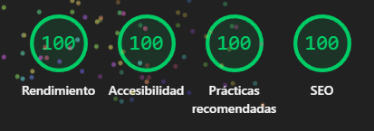
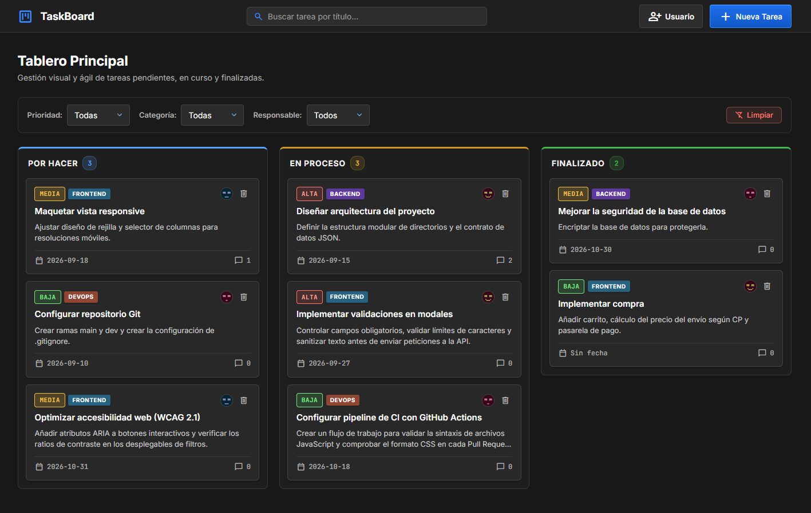
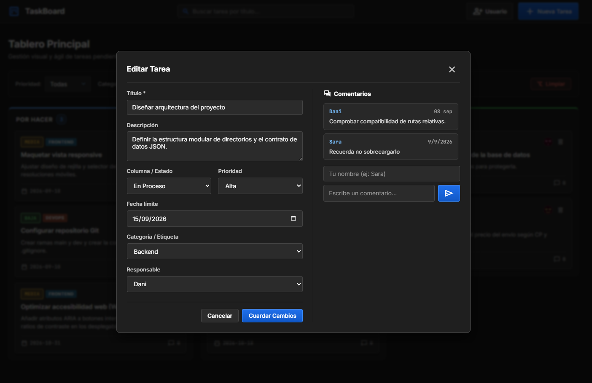
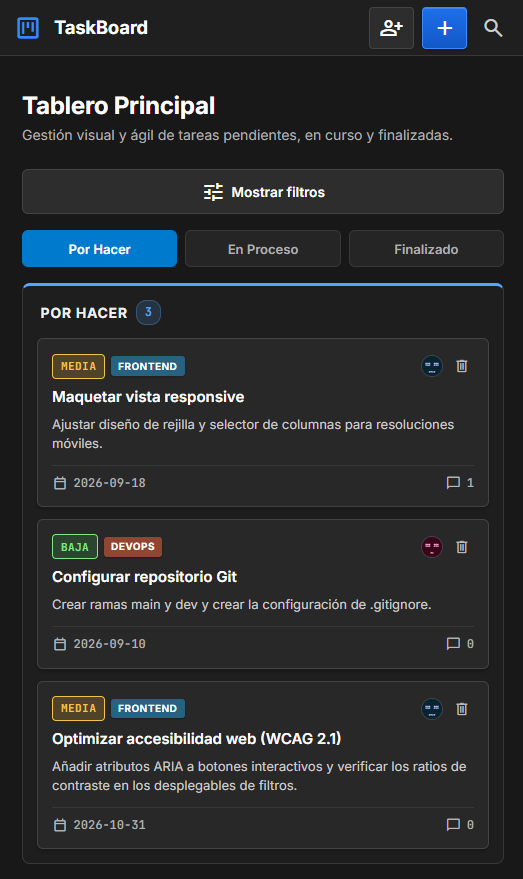

# 📋 TaskBoard — Tablero Kanban Ágil

**Aplicación web interactiva para la gestión visual de tareas bajo metodología Kanban, desarrollada íntegramente con JavaScript Vanilla modular y arquitectura CSS desacoplada.**

[🌐 Ver Despliegue en GitHub Pages](https://sazu97.github.io/Task-Web/)

---

## 📖 Índice

1. [Descripción del Proyecto](#-descripción-del-proyecto)
2. [Instalación y Ejecución Local](#-instalación-y-ejecución-local)
3. [Características Principales](#-características-principales)
4. [Stack Tecnológico](#-stack-tecnológico)
5. [Estructura del Proyecto](#-estructura-del-proyecto)
6. [Auditoría y Rendimiento (Lighthouse)](#-auditoría-y-rendimiento-lighthouse)
7. [Evidencias de Funcionamiento](#-evidencias-de-funcionamiento)

---

## 📌 Descripción del Proyecto

**TaskBoard** es un gestor de flujos de trabajo optimizado para planificar, categorizar y monitorizar tareas en tiempo real. 

El proyecto cumple con los estándares web modernos: manipulación nativa del DOM sin librerías intermediarias (excepto SortableJS para la capa táctil), elementos semánticos de HTML5 (`<dialog>` para modales nativos), sanitización manual de cadenas para evitar inyecciones XSS y persistencia emulada mediante una API RESTful local con `json-server`.

> **Nota sobre el despliegue en GitHub Pages:**  
> GitHub Pages aloja la versión estática (frontend) del proyecto. Debido a las directivas de seguridad de los navegadores (*Mixed Content* entre HTTPS y HTTP local), la persistencia de datos (creación, edición, comentarios y persistencia de arrastre) requiere ejecutar la API localmente mediante `json-server` siguiendo la guía que figura a continuación.

---

## 🚀 Instalación y Ejecución Local

Para clonar el proyecto, inicializar la API REST mock y ejecutar la aplicación en un entorno de desarrollo local, sigue estos pasos:

### 1. Requisitos previos
* Disponer de **Node.js** (versión 16.x o superior) instalado en el equipo: [Descargar Node.js](https://nodejs.org/).
* Un navegador moderno (Google Chrome, Mozilla Firefox, Microsoft Edge, etc.).
* Una extensión de servidor web estático para tu editor (recomendado **Live Server** para Visual Studio Code).

### 2. Clonar el repositorio
Abre la terminal en la carpeta donde desees alojar el proyecto y ejecuta:
~~~bash
git clone https://github.com/Sazu97/Task-Web.git
cd Task-Web
~~~

### 3. Iniciar el servidor mock (`json-server`)
La persistencia de datos depende del archivo alojado en `data/db.json`. Inicia el servidor ejecutando:
~~~bash
npx json-server --watch data/db.json --port 3000
~~~

> **¿Por qué `npx`? (Arquitectura limpia sin `node_modules`):**  
> Al tratarse de una arquitectura en JavaScript Vanilla con módulos ES6 nativos y sin empaquetadores, el comando `npx` ejecuta `json-server` directamente desde la memoria caché temporal de Node.js sin necesidad de instalar dependencias locales ni saturar el repositorio con una carpeta `node_modules`.

> **Alternativa (Instalación global):**  
> Si prefieres tener el comando disponible de forma permanente en tu sistema:
> ~~~bash
> npm install -g json-server
> json-server --watch data/db.json --port 3000
> ~~~

El servidor quedará a la escucha en el puerto `3000`, ofreciendo los siguientes endpoints:
* **Tareas:** `http://localhost:3000/tasks` (`GET`, `POST`, `PATCH`, `DELETE`)
* **Usuarios:** `http://localhost:3000/users` (`GET`, `POST`)

### 4. Abrir la aplicación
Mantén la terminal de `json-server` en ejecución en segundo plano y procede a servir el frontend:
* **En VS Code:** Haz clic derecho sobre el archivo `index.html` y selecciona **"Open with Live Server"**.
* La aplicación se iniciará de forma predeterminada en `http://127.0.0.1:5500/`.

---

## 🎯 Características Principales

* 🔄 **Drag & Drop interactivo:** Reordenación y cambio de estado entre columnas (*Por Hacer*, *En Proceso*, *Finalizado*) mediante SortableJS, con persistencia automática por `PATCH` y reversión de posición (rollback) en caso de caída de conexión.
* 📝 **Gestión completa CRUD:** Creación modal de tareas, visualización en detalle, edición integral de metadatos y eliminación confirmada.
* 🔍 **Búsqueda y filtros reactivos:** Filtrado en tiempo real por texto predictivo, combinable simultáneamente con selector de prioridad (*Alta*, *Media*, *Baja*), categoría técnica (*Frontend*, *Backend*, *DevOps*, *Diseño*, *Bugs*) y responsable asignado.
* 💬 **Sistema de comentarios por tarea:** Sección de debate cronológico integrada dentro del modal de detalle para dejar notas con fecha y autoría.
* 👤 **Gestión de perfiles de usuario:** Registro dinámico de miembros del equipo con generación automática o personalizada de avatares vía API externa.
* 📱 **Diseño adaptativo (Mobile-First):** Interfaz responsive optimizada para dispositivos móviles con barra colapsable de filtros y navegación por pestañas para las columnas.
* 🛡️ **Seguridad contra XSS:** Sanitización estricta de cadenas de texto antes de su inserción en el DOM para neutralizar inyecciones de código malicioso.

---

## 🛠️ Stack Tecnológico

* **HTML5:** Marcado semántico (`<header>`, `<main>`, `<section>`, `<article>`) y modales nativos accesibles (`<dialog>` con directivas `aria-labelledby`).
* **CSS3:** Arquitectura modular (`base.css`, `board.css`, `modals.css`), paleta temática en modo oscuro, ratios de contraste WCAG AA y directivas `line-clamp` estándar.
* **JavaScript (Vanilla ES6+):** Módulos nativos (`import`/`export`), carga paralela asíncrona (`Promise.all`), manipulación limpia del DOM sin frameworks ni dependencias de compilación.
* **SortableJS:** Micro-librería para la gestión de arrastre y soltado de elementos interactivos.
* **JSON Server:** Servidor de base de datos simulada para el consumo de peticiones RESTful.

---

## 📂 Estructura del Proyecto

~~~text
Task-Web/
├── index.html              # Estructura principal y plantillas modales <dialog>
├── .gitignore              # Exclusiones de Git (node_modules, cachés, logs)
├── README.md               # Documentación y manual de puesta en marcha
├── data/
│   └── db.json             # Base de datos local para json-server
├── docs/                   # Recursos visuales y evidencias de auditoría
│   ├── 100.png             # Captura de auditoría Lighthouse
│   ├── C1.png              # Tablero principal en escritorio
│   ├── C2.png              # Modal de detalle y edición
│   └── C3.png              # Vista responsive en dispositivo móvil
├── src/
│   └── css/
│       ├── base.css        # Resets, tipografía, cabecera y estructura global
│       ├── board.css       # Columnas, tarjetas, badges, responsive y a11y
│       └── modals.css      # Estilos de formularios, diálogos y comentarios
└── js/
    ├── app.js              # Punto de entrada y orquestación de la carga inicial
    ├── api.js              # Módulo de consumo HTTP y control de respuestas Fetch
    ├── ui.js               # Renderizado del DOM, contadores, filtros y sanitización
    ├── modals.js           # Controladores de formularios y validación de modales
    └── dragDrop.js         # Inicialización de SortableJS y persistencia de arrastre
~~~

---

## ⚡ Auditoría y Rendimiento (Lighthouse)

La aplicación ha sido auditada exhaustivamente mediante Google Lighthouse, alcanzando la máxima puntuación en escritorio y optimización para entornos móviles:

| Métrica | Desktop | Mobile | Estado |
| :--- | :---: | :---: | :---: |
| 🚀 **Rendimiento** | **100** | **98** | ✅ Óptimo |
| ♿ **Accesibilidad** | **100** | **100** | ✅ Cumplimiento WCAG AA |
| 🛡️ **Prácticas recomendadas** | **100** | **100** | ✅ Estándares modernos |
| 🔎 **SEO** | **100** | **100** | ✅ Totalmente indexable |

---

## 📸 Evidencias de Funcionamiento

### 1. Tablero Principal (Escritorio)
Visualización completa del flujo de trabajo con columnas por estado, etiquetas de prioridad, categorías técnicas y avatares de usuario:

---

### 2. Detalle y Edición de Tarea
Modal flotante con soporte para modificación de metadatos, selector de fecha nativo adaptado al tema oscuro y panel cronológico de comentarios:

  

---

### 3. Adaptabilidad Móvil (Responsive)
Diseño móvil fluido con navegación por pestañas para alternar entre columnas y barra colapsable de filtros:

  

